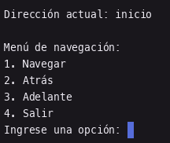

# Proyecto Web Browser

Crear una aplicación de escritorio que simule las opciones Atrás y Adelante de un navegador web haciendo uso de dos pilas.
El programa deberá tener un menú con las siguientes opciones:

1. Navegar.
2. Atrás
3. Adelante

La opción Navegar deberá solicitar una dirección web (No es necesario validar que la dirección exista) y una vez ingresada deberá regresar al menú principal en el cual se mostrará la dirección actual.
La opción Atrás deberá regresar a la página anterior en caso de haber una.
La opción Adelante deberá asignar la dirección desde la cual retrocedimos a la actual en caso de existir alguna.

El usuario deberá poder navegar hacia Atrás y Adelante mientras haya direcciones disponibles.

Entregar el código generado en un archivo comprimido con el nombre siguiendo el patrón:
primerApellido_segundoApellido_proyecto

## Captura de la salida de cada una de los programas

## Archivo a entregar

:paperclip: 
